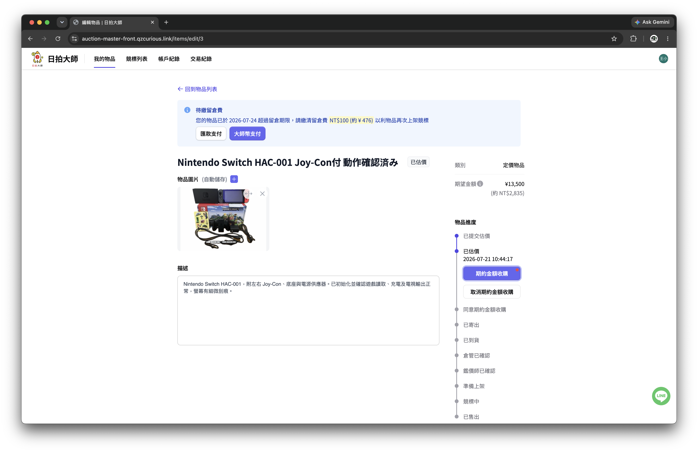

# Auction Master Front

**Demo：<https://auction-master-front.qzcurious.link/>**

代競拍平台的使用者前台，對應營運後台 [auction-master-admin-next](https://github.com/QzCurious/auction-master-admin-next)。使用者可以從這裡建立要送拍的物品、追蹤處理進度與競拍結果，並繼續處理成交後的費用、餘額與交易紀錄。

## 功能

### 委託物品建立與管理

使用者可以建立要交由平台處理的物品，填寫商品資料與完整說明，並上傳多張照片。照片可直接拖曳調整順序，讓實際送拍時的商品資訊可以在同一個地方整理完成。

物品描述支援富文本編輯，除了基本文字，也能整理較長的商品說明與注意事項。

### 清楚追蹤每件物品的進度

一件物品從送出後，不會只停留在「已建立」或「已完成」兩種狀態，而是會依實際處理流程經過審核、寄送、到貨、準備上架、競拍與後續處理等階段。

前台會依物品目前所在的階段顯示狀態與可進行的操作，並保留狀態歷程，讓使用者可以直接知道物品現在在哪裡、之前經過哪些處理，以及接下來需要做什麼。

### 競拍進度與成交後處理

物品正式進入競拍後，可以在獨立的競拍列表中追蹤狀態與結果，並查看成交資訊。競拍結束後的相關費用、取消或其他後續操作，也沿用同一筆物品與競拍資料繼續處理。

### 篩選與大量資料瀏覽

物品、競拍與交易紀錄都提供對應的狀態與條件篩選。篩選條件會同步到網址，因此重新整理、返回頁面或分享目前查詢時，都能保留相同的瀏覽狀態。

### 餘額與交易紀錄

使用者可以查看目前帳戶餘額、資金異動與歷史紀錄，也能提出提款需求。物品成交後的款項與其他費用，不需要另外到不同系統查詢。

### 會員與身分資料

提供註冊、登入、個人資料、密碼與身分驗證相關流程，讓需要進行實名資料確認的代競拍服務可以直接在平台內完成。

### 平台資訊

首頁提供平台服務入口與最新內容，另外包含佣金規則、常見問題、運送與交易說明等資訊，讓使用者在實際送件前能先理解服務方式與費用。

## 技術重點

- **Next.js App Router + SSR**：以 Next.js 建構主要頁面，讓需要資料的畫面可以在伺服器端完成初始呈現。
- **React + TypeScript**：以型別管理 API 資料、表單與不同物品狀態，降低跨流程資料使用時的不一致。
- **TanStack Query**：處理登入後的伺服器資料查詢、快取與更新後重新同步。
- **React Hook Form + Zod**：處理建立物品、會員資料、身分驗證等表單與輸入驗證。
- **Tailwind CSS + Headless UI**：建立前台主要介面與互動元件，同時保留版面與元件樣式的調整彈性。
- **Quill**：提供商品描述的富文本編輯能力。
- **Query String driven filters**：將列表篩選、分頁等瀏覽狀態同步到 URL，讓畫面狀態可以被重新載入與分享。
- **Drizzle ORM + MySQL**：網站本身需要直接管理的資料，例如首頁輪播，透過 Drizzle 存取資料庫並與後台共用。

## Related

- 營運後台：[QzCurious/auction-master-admin-next](https://github.com/QzCurious/auction-master-admin-next)
